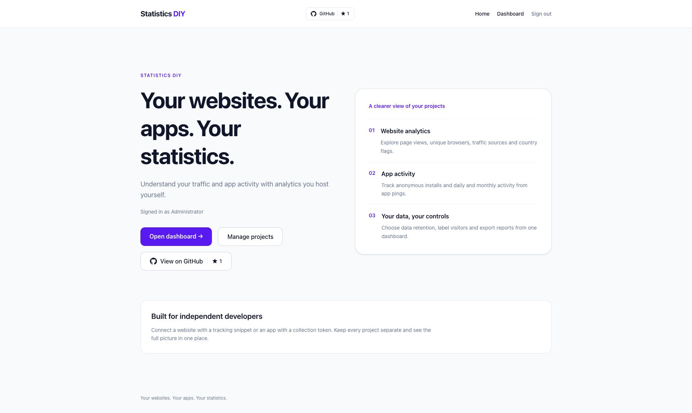
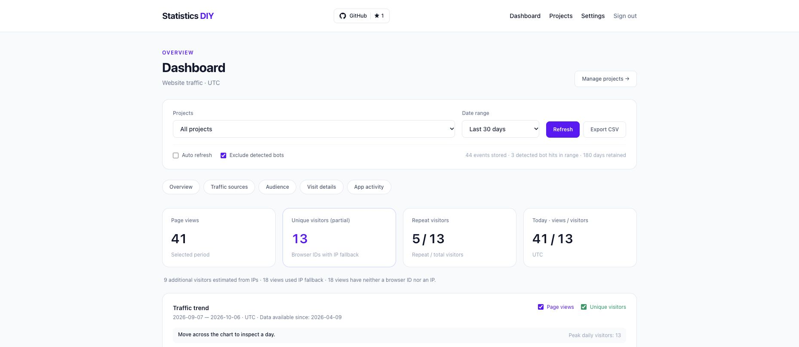
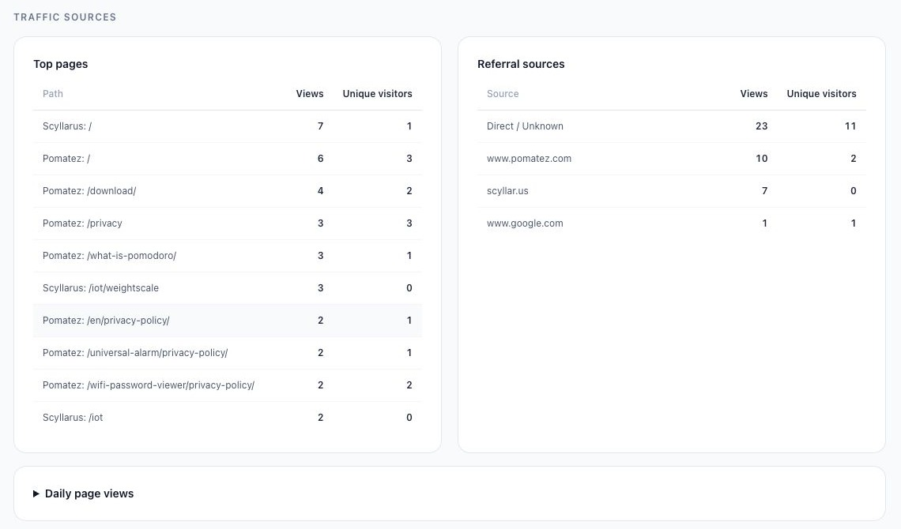
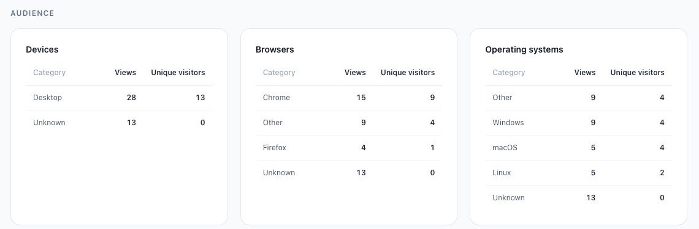
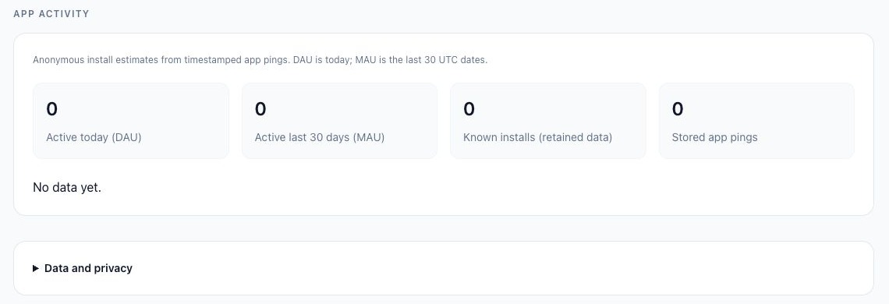

# Statistics DIY

Self-hosted website and app analytics for independent developers.

**Your websites. Your apps. Your statistics.**

Project domain: `statistics.diy`

## Screenshots

Captured from [statistics.diy](https://statistics.diy/) on October 6, 2026.

### Home



### Dashboard overview

The dashboard screenshot shows the overview controls and summary cards; visitor IP addresses and visit details are outside the captured area.



### Traffic sources

Popular pages and referral sources.



### Audience

Device, browser, and operating system breakdowns, excluding the IP address table.



### App activity

Daily and monthly active installs, retained installs, and stored app pings. This screenshot shows the current empty state.



These additional screenshots were captured on October 7, 2026.

## One-line installation

On Linux or macOS with **Docker running and Docker Compose v2 installed**:

```bash
curl -fsSL https://raw.githubusercontent.com/scyllarusllc/statistics.diy/main/install.sh | bash
```

This builds and starts Frappe version 16, MariaDB, Redis, workers, and Statistics DIY in a dedicated Docker Compose stack. It creates the `statistics.localhost` site and installs `statistics_diy`; no existing Bench is modified. Docker itself is a prerequisite and is not installed by this script.

Open **http://localhost:8080** and sign in as **Administrator**. The generated password is the `ADMIN_PASSWORD` value in `~/.local/share/statistics-diy/.env`. This file is created with private permissions; it is preserved on retries. The installation currently opens the Frappe login/Desk, not a finished analytics dashboard.

The initial image build can take several minutes and requires enough disk space for the Frappe build and its containers. Docker must support BuildKit secrets. The build uses a [pinned official Frappe Docker recipe](https://github.com/frappe/frappe_docker/tree/f71a386bc13f75dcc0cf7462f025f531576a04fc); Frappe's `version-16` branch and the app's `main` branch track their current code.

To choose a different port and installation directory:

```bash
curl -fsSL https://raw.githubusercontent.com/scyllarusllc/statistics.diy/main/install.sh | STATISTICS_DIY_PORT=8081 STATISTICS_DIY_DIR="$HOME/statistics-diy-server" bash
```

These settings apply on first installation. Reruns reuse the existing `.env` and persistent database/site volumes. The installer manages one stack named `statistics-diy` per Docker daemon. It does not support multiple instances or upgrades of established deployments yet. If an installation is interrupted, rerun the same command; do not delete database volumes to retry.

Manage the default installation:

```bash
cd ~/.local/share/statistics-diy
docker compose ps
docker compose logs --tail=100
docker compose stop
docker compose start
```

The web port binds to localhost. Public deployment requires a reverse proxy with HTTPS, appropriate host/proxy settings, and a backup plan. Domain hosting and TLS are not configured by this installer.

## Status

`statistics_diy` is an independent Frappe app. The first website analytics slice includes projects, page-view collection, a tracking script and a basic Desk report. App analytics and advanced reporting remain to be implemented.

## Why this project exists

Independent developers often maintain both a website and a desktop or mobile app. Statistics DIY aims to bring website traffic and app usage into one simple dashboard that developers can run on their own infrastructure.

The initial idea comes from the website and app analytics features in VibeCMS. Those features provide useful experience with collection and presentation, while this project will define its own independent data model and deployment workflow.

Existing projects such as [Umami](https://docs.umami.is/docs/about) and [Plausible](https://plausible.io/open-source-website-analytics) already offer self-hosted website analytics. Statistics DIY will focus on a small, understandable experience that combines websites and apps.

## First release scope

### Website analytics

- Page views and unique visitor estimates.
- Popular pages and referral sources.
- Country, browser, operating system, and device breakdowns.
- Daily trends with explicit reporting timezone and retention boundaries.
- Integration through a lightweight JavaScript snippet.

### App analytics

- First-seen anonymous installs, rather than an unverifiable count of all installations.
- Daily and monthly active installs based on recorded activity.
- App version, operating system, and release bundle breakdowns.
- Ping counts within the selected reporting period.
- Integration through a documented HTTP endpoint suitable for desktop and mobile apps.

### Project management and deployment

- Multiple websites and apps in one instance.
- Project-scoped collection credentials and isolated reporting data.
- Administrator authentication and project access controls.
- One-line Docker installation or installation on an existing Frappe Bench.
- Setup documentation and synthetic demonstration data.

Session replay, experiments, advertising attribution, and payment processing are outside the first release scope.

## Data accuracy principles

1. Store timestamped events or daily activity records. A mutable `last_seen` field alone cannot reconstruct historical daily activity.
2. Define DAU as distinct installs active during a calendar day in the reporting timezone. Label rolling 24-hour activity separately.
3. Define MAU as distinct installs active within a documented 30-day window. Counts of installs are not counts of people.
4. Calculate period ping totals from activity within that period, not lifetime counters of currently active installs.
5. Separate website visitor estimates from app install identities. Avoid presenting either as an exact count of people.
6. Distinguish missing or expired data from observed zero activity. Charts must show the available retention window.
7. Keep project identity on all events, activity records, aggregates, and reporting queries.
8. Support retries and deduplication so repeated submissions do not silently inflate statistics.

## Privacy direction

- Avoid persistent browser fingerprinting by default.
- Website IP reports retain visitor addresses under the configured retention policy. App activity uses anonymous install IDs and does not store IPs.
- Use client-generated, resettable anonymous install IDs for optional app analytics.
- Respect website tracking opt-out settings and document collection behavior.
- Document how website unique visitor estimates are calculated and their limitations before implementation.
- Keep credentials, production data, and identifiable sample data out of the repository.

Exact collection defaults and retention periods will be documented as the implementation develops.

## Version-one architecture

- **Framework:** Frappe, as a standalone app with no dependency on VibeCMS or ERPNext.
- **App/package name:** `statistics_diy`, avoiding a collision with Python's standard-library `statistics` module.
- **Collector:** Frappe HTTP endpoints accepting website and app events through a documented, framework-neutral protocol.
- **Database:** the database supported by the target Frappe Bench, initially MariaDB in the existing development environment. PostgreSQL is not a version-one requirement.
- **Data model:** project-scoped DocTypes for projects, events, anonymous installs, daily activity, and reporting aggregates. Detailed schemas remain to be implemented.
- **Dashboard:** Frappe-backed analytics pages with authentication and project access controls.
- **Background work:** Frappe queues and scheduler for aggregation and retention tasks.
- **Deployment:** the one-line Docker installer, or an existing Frappe Bench.

Frappe supplies the initial application foundation, permissions, migrations, and background jobs. Collection clients do not need Frappe: ordinary websites and desktop/mobile apps will submit events over HTTP. VibeCMS will be one such client.

Keep collection validation and aggregation logic separate from page rendering and framework adapters. Frequently refreshed dashboards should use bounded queries and appropriate aggregates instead of recalculating every report on every refresh.

A separate collector or analytics database can be introduced later if measured traffic and query performance justify it. This is an extension path, not a first-release requirement.

## Install the app skeleton

### Local development with Make

With Docker running and Docker Compose v2 installed:

```bash
make dev
```

The first run builds a development image with Python 3.14, Node 24, Yarn,
Redis, and Bench, initializes a separate Frappe `version-16` Bench, creates
`statistics.localhost`, installs this checkout, enables developer mode, and
finally runs `bench start` in the foreground inside the container. The current
source directory is mounted and linked into Bench so edits use your local code.
The version requirements follow the [Frappe installation guide](https://docs.frappe.io/framework/user/en/installation).
Docker itself must already be installed and accessible to your user.

Open **http://localhost:8000** and log in as **Administrator** with password
**statistics-dev-admin**. These fixed credentials are only for local development;
the web and Socket.IO ports bind to localhost and the database has no published
port. Open `/app/analytics` in Frappe Desk for the initial page-view report.

Press Ctrl+C to stop Bench. Rerun `make dev` to reuse the Bench, site, and database
stored in Docker volumes. Run `make dev-stop` to stop the development stack while
preserving those volumes. This uses a separate Compose project from `install.sh`.
Do not run two `make dev` sessions at once. Before building, `make dev` checks
both host ports. If a port is occupied, it shows the listener and asks
`Stop these listeners and continue? [y/N]`. Confirming stops the owning Docker
container (preserving its volumes) or sends SIGTERM to the host process, then
waits for the port to become free. Declining or running without input cancels
startup. It never forces a kill. Port checks require `ss` or `lsof`. On Linux, files generated in the
mounted checkout belong to container UID 1000; your user may need to adjust their
ownership before editing them.

To use different host ports:

```bash
STATISTICS_DIY_DEV_PORT=8001 STATISTICS_DIY_DEV_SOCKETIO_PORT=9001 make dev
```

First-time setup requires network access and can take several minutes. If setup
fails, `bench start` is not run; retry after resolving the reported error. An
incomplete initial Bench clone or virtual environment requires inspection of the
development volume before retrying; the script does not delete existing data.

### Existing Bench

From an existing, compatible Frappe Bench, install this local checkout:

```bash
bench get-app /absolute/path/to/statistics.diy
bench --site your-site.example install-app statistics_diy
bench --site your-site.example list-apps
```

For this checkout, the local path is `~/github/statistics.diy`. Use a development site for the initial installation. Installing the skeleton registers the app and its module; it does not provide analytics features yet.

The package requires Python 3.10 or newer. The selected Frappe release may require a newer Python version. A supported Frappe version matrix will be published after installation and migration checks on a development site.

## Development roadmap

1. Specify event schemas, anonymous identities, project isolation, metric definitions, and retention rules.
2. Implement Frappe DocTypes and collection endpoints with validation, rate limiting, and retry deduplication.
3. Add the website snippet and an app integration example.
4. Build dashboards for website traffic and app activity with correct historical trends.
5. Configure Frappe roles and project permissions; add deployment instructions, migrations, and synthetic demo data.
6. Validate using the Pomatez website and app, without publishing their production analytics.
7. Publish the first open-source release once deployment and metric accuracy are verified.

## Development checks

Meaningful verification should cover project isolation, event validation, retry behavior, timezone boundaries, daily/monthly distinct counts, retention boundaries, and period ping totals.

The app is installed on the development Frappe site. The analytics integration verification command is documented below.

Installer contract checks can be run without Docker:

```bash
python3 -m unittest discover -s tests -v
bash -n install.sh
```

These tests simulate downloads and Docker commands. They verify installation order, private credential files, retries, and input validation; they do not validate a running Frappe deployment. A full Docker build and site startup have not yet been verified.

## License

MIT is the proposed license. A license file and copyright attribution will be added before the first public release, after confirming ownership and any reused code licenses.

## First analytics workflow

The app now includes **Analytics Project**, **Analytics Event**, a page-view tracker,
and custom Tailwind CSS pages at `/statistics_diy/admin/dashboard` and
`/statistics_diy/admin/projects` (System Manager access).

1. Sign in at `/statistics_diy/login`, open `/statistics_diy/admin/projects` and select **创建项目**.
2. Enter the project name and exact website origin, e.g. `https://example.com`.
3. Save and expand **获取追踪代码**, then copy the snippet into the website's HTML.
4. Choose the project on `/statistics_diy/admin/dashboard` to see page views, daily totals, top paths and referral sources. Select a 7/30/90-day range or export the report as CSV.

The current snippet uses `https://statistics.diy` as the collector host. For another
installation, adjust the script URL. Collection keys are public project identifiers,
not secrets. Origin checks discourage accidental cross-project submissions but do
not authenticate arbitrary HTTP clients or prevent forged analytics.

This first slice records server receipt time in UTC, pathname and referrer hostname.
It stores visitor IP addresses for IP reports, but does not store query strings or cookies. The tracker uses an anonymous browser identifier for unique visitor estimates, described below. The
tracker honors browser Do Not Track. It tracks initial document loads; SPA navigation,
app activity, country/device reports and automated retention are not
implemented. Reports cover selectable 7/30/90 UTC calendar days, including today; events currently remain stored
until explicitly deleted. Collection is capped at 1,000 requests per project per minute.

Apply schema and asset changes in a Bench using:

```bash
bench --site statistics.localhost migrate
bench build --app statistics_diy
```

Integration verification creates temporary projects and events and removes them:

```bash
bench --site statistics.localhost execute statistics_diy.verify.run
```

This verification includes an HTTP request through `https://statistics.diy`; adapt
that URL when validating another deployment.

### Custom administration UI

Login, projects (including creation/editing), and the dashboard use standalone
HTML templates, vanilla JavaScript and compiled Tailwind CSS. They do not load
Frappe UI styles/scripts or link to Desk. Frappe supplies sessions, CSRF protection,
permissions and database operations.

Rebuild the committed CSS after changing templates or Tailwind classes (Node 20+):

```bash
npm ci
npm run build:css
```

Verify the administration pages and project editor inside Bench:

```bash
bench --site statistics.localhost execute statistics_diy.verify.dashboard
bench --site statistics.localhost execute statistics_diy.verify.projects
bench --site statistics.localhost execute statistics_diy.verify.project_editor
```

### Report ranges and exports

Dashboard ranges include the current UTC date and the preceding 6, 29 or 89 dates.
Today is partial. Days without events show zero; events outside the date boundaries
are excluded. Page and referral tables include the top 10 entries. Empty referrers
are labelled Direct / Unknown. The CSV includes daily totals and both top-10 tables
for the selected project and date range; it is not a raw event export.

Verify report boundaries and aggregation:

```bash
bench --site statistics.localhost execute statistics_diy.verify.reports
```

The dashboard defaults to **All projects**, showing combined page views and daily
traffic plus a total for every project, including projects with zero traffic or
collection disabled. Select a project or click its summary row for details.
Combined top pages remain separated by project even when paths match. CSV exports
include project totals and identify the project for each top-page entry.

```bash
bench --site statistics.localhost execute statistics_diy.verify.all_projects
```

### Unique visitor estimates

The tracker now assigns an anonymous UUID in the tracked website's localStorage,
separately for each project, with a fixed 90-day lifetime. The collector stores a
project-scoped SHA-256 hash. Unique visitors count distinct browser identifiers
within the selected period; daily counts deduplicate separately each UTC day.
All-project totals sum project-specific unique counts rather than deduplicating
people across websites. Different browsers, cleared storage and expiration can
increase counts. These are estimates of browsers, not people.

Older events or storage-blocked browsers have no visitor identifier. Their views
remain included and can use IP fallback when an address is recorded; the dashboard displays the
number of unmeasured views. Daily unique counts must not be summed to determine
period uniques. CSV exports include uniques for project and daily rows.

The tracker uses a stable, unversioned URL. The reverse proxy must send
`Cache-Control: no-cache, max-age=0, must-revalidate` for this file, so browsers
revalidate it on each page load. Existing versioned URLs continue to work. Add `data-visitors="off"` to the script to disable
visitor storage while still counting page views. Do Not Track and Global Privacy
Control disable both collection and visitor storage.

```bash
bench --site statistics.localhost execute statistics_diy.verify.visitors
```

### Visitor details and app analytics

The dashboard now supports 365-day selection, optional auto refresh every minute
while the tab is visible, and heuristic User-Agent bot exclusion. It shows repeat
browser IDs (more than one page view in the selected period), today's UTC totals,
devices/browsers/operating systems, recent visits and editable project-specific
visitor labels. Both views and unique browsers are shown for pages, referrers and
breakdowns. Historical events without metadata appear as Unknown; session counts
are unavailable for events without session IDs. New tracker sessions are per tab,
renewed after 30 minutes of inactivity between tracked page loads. No persistent
device fingerprint or raw User-Agent is stored.

The stable tracker URL delivers session and timezone collection updates without changing website snippets.
Detected bots are stored but excluded from reports by default. Bot detection is
heuristic, not proof that every included visitor is human. Country/city lookup is not configured. IP addresses are now stored for recent visits and top-IP reports, under the event retention policy. The reference statistics are not seed data.

Expand **App integration** on a project for its separate app collection token.
Send JSON to `POST /api/method/statistics_diy.activity.ping` with `token`,
`install_id` (random UUID stored on first launch), `event_id` (new UUID per ping),
`platform` (Windows/Linux/macOS/iOS/Android/Other) and `app_version`. Retry with the
same event ID to avoid double counting. The token identifies app traffic; it is
not proof of a real install, and distributing it in a client cannot prevent forged
activity. Installs are project-scoped estimates, not people. DAU counts installs
with pings today in UTC; MAU counts installs active on the latest 30 UTC dates.
These counters use timestamped events, not a mutable last-seen value, and are
independent of the selected website report range.

Settings controls retention (30/90/180/365 days, default 180). Daily cleanup deletes
expired website/app events and orphaned labels. Dates outside retention are shown
as unavailable instead of zero. Known installs cover retained activity, not
lifetime installs. The **Clear analytics data** action requires typing
`DELETE ANALYTICS`; it preserves project configurations. No live data is cleared
merely by adding this control.

Verification uses temporary data and rolls changes back:

```bash
bench --site statistics.localhost execute statistics_diy.verify.advanced
```

The traffic trend supports visible hover/focus tooltips, views/visitor series
checkboxes, and clickable day selection. Selecting a retained day filters website
report totals, tables and exports while keeping the full-range trend visible.
**Back to full range** clears the selection. Arrow keys, Home/End and Enter/Space
navigate and select days. Dates outside retention cannot be selected. Today's
counters and app DAU/MAU retain their explicitly labelled time windows.

```bash
bench --site statistics.localhost execute statistics_diy.verify.trend_interactions
```

### IP addresses

New website events store normalized IPv4/IPv6 addresses. Recent visits, the top-15
IP table and CSV exports include them. Existing records without IPs remain
unrecorded; IP is used as a fallback only when a browser ID is missing. These records follow the
same retention and clear-data controls as other website events. App pings do not
store IPs. Location lookup remains unconfigured.

The current Caddy proxy overwrites `X-Statistics-Client-IP` and authenticates that
header to Frappe using `X-Statistics-Proxy-Token`, matched against the private
`statistics_proxy_token` site configuration. It accepts `CF-Connecting-IP` only
from Cloudflare's published network ranges; other requests use the direct peer
address. Unauthenticated forwarded headers are ignored by the app. Future proxy
deployments must configure the same trust boundary rather than passing arbitrary
client headers. Keep the proxy token private and Cloudflare ranges current.

```bash
bench --site statistics.localhost execute statistics_diy.verify.ip_addresses
```

### Country flags

Top IPs and recent visits show country flag emoji, with the country name on hover.
Lookups run locally against DB-IP Country Lite; no visitor IP is sent to a lookup
service. Private, invalid or unknown addresses have no flag. Country assignments
are approximate and based on the current database, including for historical IPs.

The deployed October 2026 database is stored in the persistent development volume
at `/workspace/geoip/country.mmdb`. It is not included in this repository. For another
installation, provide a current MMDB file and set `statistics_geoip_database` in
site configuration (or `STATISTICS_GEOIP_DATABASE` in the environment). Refresh the
file periodically using DB-IP's monthly release. The dashboard includes the required
[DB-IP attribution](https://db-ip.com/db/download/ip-to-country-lite).

```bash
bench --site statistics.localhost execute statistics_diy.verify.country_flags
```

### Public homepage

`/statistics_diy/user/homepage` is the custom Tailwind homepage and is also served
at `/`. Guests can sign in; administrators get dashboard and project links. The
root is pinned to this page even when a Frappe workspace defines another homepage.
Existing administration and collection routes continue through normal routing.
The homepage supports the same English/Chinese preference as the rest of the site.

```bash
bench --site statistics.localhost execute statistics_diy.verify.homepage
```

### Unique-count coverage and cached trackers

The visitor card is marked **partial** when some views lack browser IDs and shows
how many views are identifiable. If a project has views but no visitor IDs, its
unique total is shown as unavailable instead of a definitive zero. Historical
browser IDs cannot be reconstructed; recorded IPs can provide fallback estimates.

After changing a tracker cache policy, existing CDN entries may still serve an
older script until expiry. Purge the exact stable tracker URL once in Cloudflare:
`https://statistics.diy/assets/statistics_diy/js/tracker.js`. The origin already
sends revalidation headers, so websites do not need versioned snippet edits.

Browser-ID stability checks can be run with:

```bash
node tests/test_tracker.js
```

### IP fallback for visitor estimates

Reports prefer browser IDs. When a view has no browser ID, its recorded IP is used
as a fallback. A repeated IP counts once per project in the report scope. If that
IP also appears with browser IDs in the same scope, missing-ID views use a
deterministic existing browser representative instead of adding another visitor.
Known browser IDs remain distinct even when they share an IP, and a browser ID
remains one visitor when its IP changes. Daily/category reports resolve the fallback
within their own day/category scope. This is an estimate: shared IPs can undercount,
changing IPs can overcount, and ambiguous missing-ID views cannot be attributed to
a particular browser with certainty.

The card reports extra visitors estimated from unmatched IPs, views using fallback,
and views lacking both identifiers. Events lacking both stay unavailable; historical
records are not rewritten. Visitor labels remain tied to explicit browser IDs.

```bash
bench --site statistics.localhost execute statistics_diy.verify.ip_fallback
```

Country flags also show the estimated city beside the IP; hover reveals the region
and country. Lookups prefer `/workspace/geoip/city.mmdb` when available, falling
back to the country-only database otherwise. Unknown records remain without a
city. The deployed database is the verified October 2026
[DB-IP City Lite](https://db-ip.com/db/download/ip-to-city-lite) release in the
persistent development volume. Visitor IPs are not sent to an external lookup API.

Verify with `bench --site statistics.localhost execute statistics_diy.verify.cities`.

The trend now snaps pointer movement to the nearest date, displays a floating
metrics tooltip and crosshair, and supports tap selection. Selecting the same day
again resets the report. Vertical touch scrolling does not trigger selection.
Keyboard users focus the chart once and use arrows/Home/End to inspect dates,
Enter/Space to select and Escape to reset. At least one series stays enabled.
Loading filtered details preserves the chart rather than hiding the report.

```bash
node tests/test_trend.js
```
